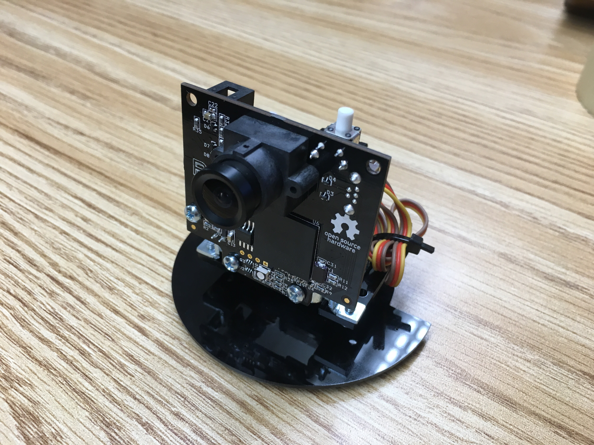
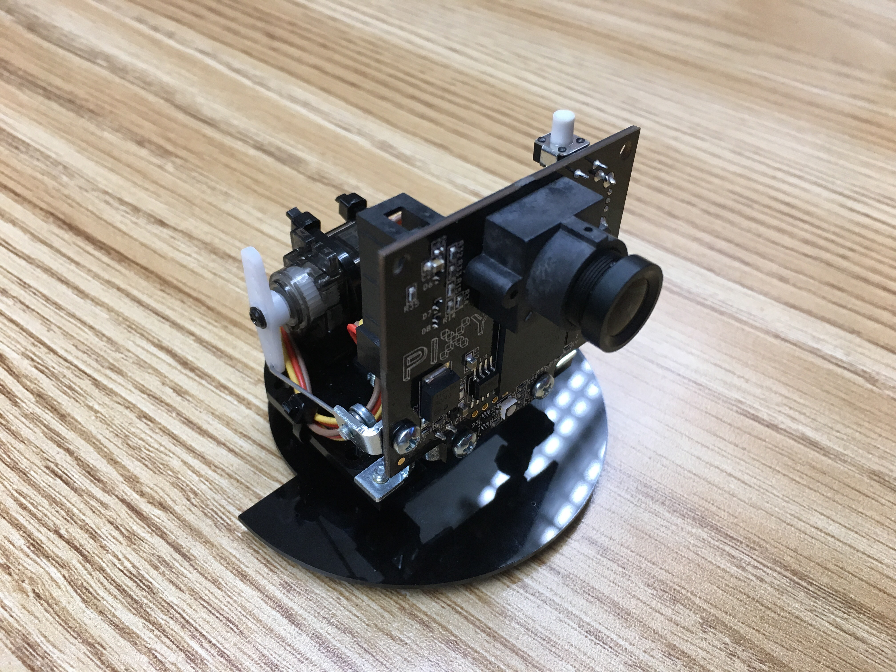
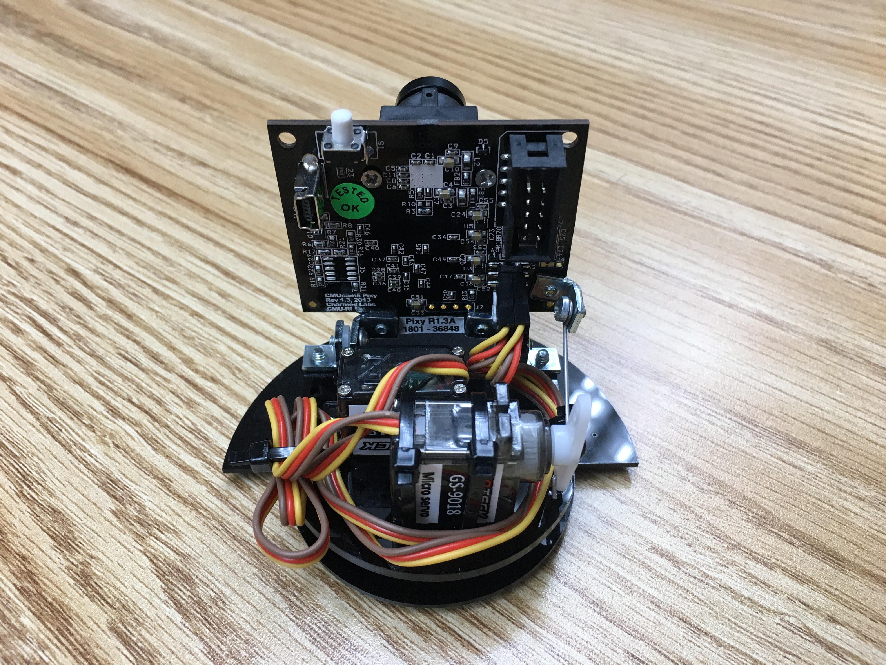

# PixyMon-Pan-and-Tilt
Guide on how to operate the Pan and Tilt mechanism for a Pixymon

# How to run Pan and Tilt
> While Pixy is powered, press the white buton on the Pixy and hold until the LED on the front turns red.  
> After the LED turns red, set the color or object you want to track in front of the Pixy.  
> Once your object is being tracked, run the Pan and Tilt Demo under the action menu.  
> The Pixy should track the color or object identified.

# Fixing a PixyMon
<ol>
<li>Try a different cable, the shorter the better.</li>
<li>If it has problems tracking your object try resetting the signature under the action menu.</li>
<li>Reexamine the mechanical aspects of the Pixy and ensure the servos can move freely.</li>
<li>Swap the servo cables around to find disfunctional pieces. (Do this if your Pixymon acts crazy and erratic)</li>
<li>Reset the settings under the action menu.</li>
</ol>

